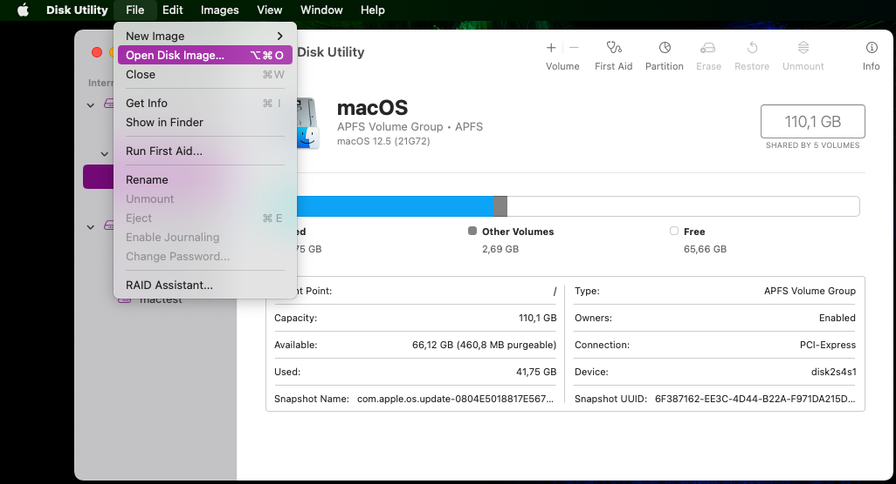
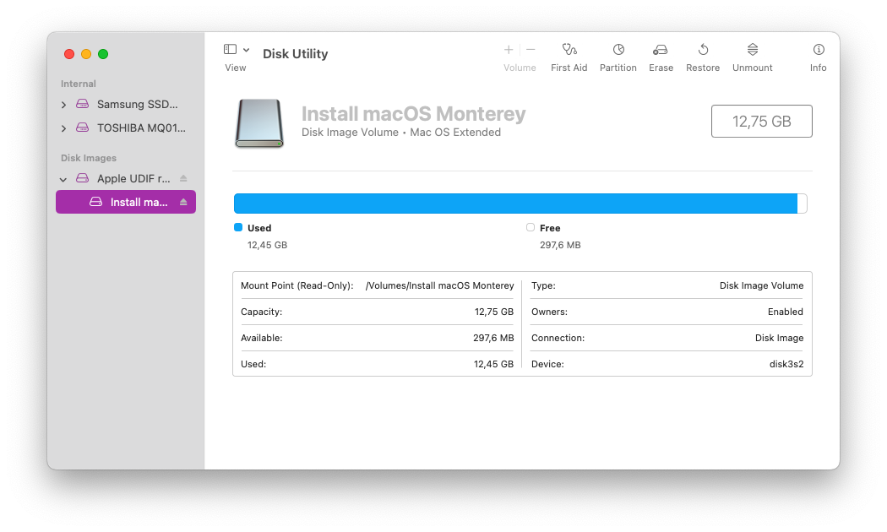
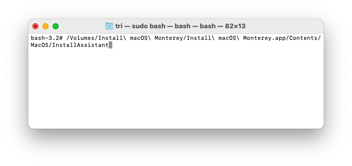

# macdmg-on-recovery
Offline install macOS using dmg file in recovery.

This instruction explain how to clean install macOS using dmg file directly from hdd/ssd without need createinstallmedia to USB.

### Requirement :
1. MacOS dmg/iso file, you can create manually from App Store or using [macadmin-scripts](https://github.com/munki/macadmin-scripts) or from [internet archive](https://archive.org/details/macos-collection).
2. Access to recovery : 
    - For hackintosh user, follow [dortania guide](https://dortania.github.io/OpenCore-Install-Guide/installer-guide/winblows-install.html).
    - For normal mac user, Command-R to go recovery mode then go to terminal turn off SIP (`csrutil disable`) then reboot go to recovery again.

### Step to install macOS :
1. Boot into recovery.
2. Open Disk Utility, select File > Open Disk Image , open dmg/iso file you want to install.



Confirm dmg/iso loaded on Disk Images section



3. Close Disk Utility, open terminal by go to Utilities > Terminal , then run `InstallAssistant` by input this command
```
 /Volumes/Install\ macOS\ Monterey/Install\ macOS\ Monterey.app/Contents/MacOS/InstallAssistant
```



<details><summary>Command for other OS</summary>
<p>

### BigSur
```
    /Volumes/Install\ macOS\ Big\ Sur/Install\ macOS\ Big\ Sur.app/Contents/MacOS/InstallAssistant
```

</p>
<p>

### Catalina
```
    /Volumes/Install\ macOS\ Catalina/Install\ macOS\ Catalina.app/Contents/MacOS/InstallAssistant
```

</p>
<p>

### Mojave
```
    /Volumes/Install\ macOS\ Mojave/Install\ macOS\ Mojave.app/Contents/MacOS/InstallAssistant
```

</p>
<p>

### HighSierra
```
    /Volumes/Install\ macOS\ High\ Sierra/Install\ macOS\ High\ Sierra.app/Contents/MacOS/InstallAssistant
```

</p>
</details>

4. Install macOS like normal installer. 
<br>

## Important Note
- You cannot downgrade OS version with this method ( ex. downgrade from Monterey to Catalina)
- This is only for clean install 
- Before install macOS make sure you format the volume partition first
- If you want to upgrade look at extra step

#

## Extra step for upgrade OS
If you have recovery with lower than macOS dmg file ( ex. HighSierra recovery and Monterey dmg file ) you need to input different command or you will get prompt to input superuser username & password 


<br />

### Step for upgrade OS :
1. Follow same step to mount dmg/iso file
2. Input this command
```
/Volumes/Install\ macOS\ Monterey/Install\ macOS\ Monterey.app/Contents/Resources/startosinstall --volume /Volumes/Target
```
Change `Target` to the name of volume you want to install 
<details><summary>Command for other OS</summary>
<p>

### BigSur
```
/Volumes/Install\ macOS\ Big\ Sur/Install\ macOS\ Big\ Sur.app/Contents/Resources/startosinstall --volume /Volumes/Target
```
</p>
<p>

### Catalina
```
/Volumes/Install\ macOS\ Catalina/Install\ macOS\ Catalina.app/Contents/Resources/startosinstall --volume /Volumes/Target
```
</p>
<p>

### Mojave
```
/Volumes/Install\ macOS\ Mojave/Install\ macOS\ Mojave.app/Contents/Resources/startosinstall --volume /Volumes/Target
```
</p>
<p>

### HighSierra
```
/Volumes/Install\ macOS\ High\ Sierra/Install\ macOS\ High\ Sierra.app/Contents/Resources/startosinstall --volume /Volumes/Target
```
</p>
</details>
<br />
 
3. It will print license agreement , to confirm it press A then enter

<br />
<br />


# Reference
https://grahamrpugh.com/2020/06/09/startosinstall-undocumented-options.html